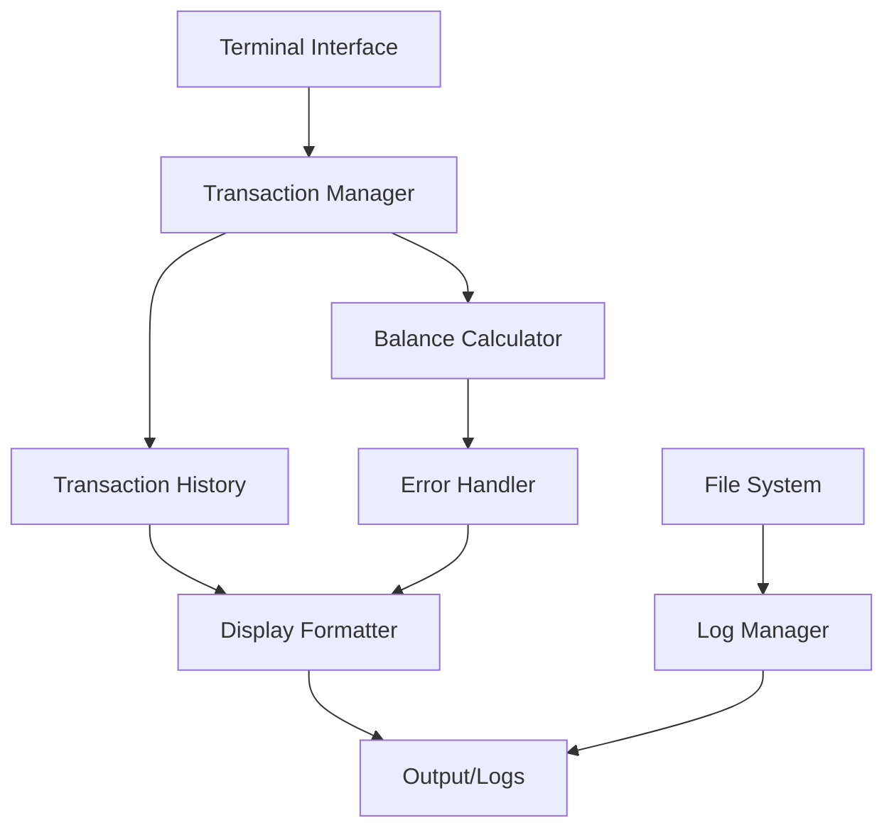
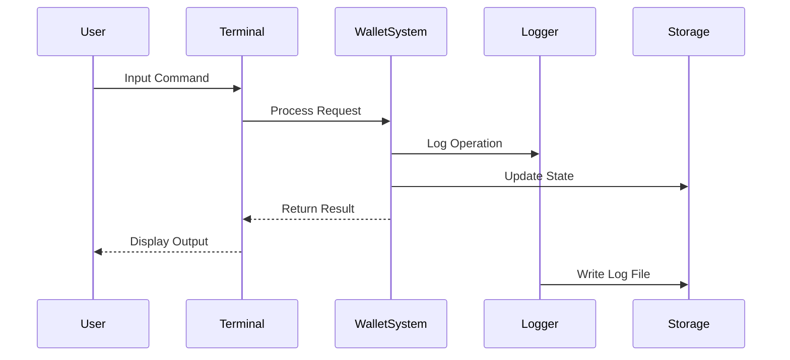
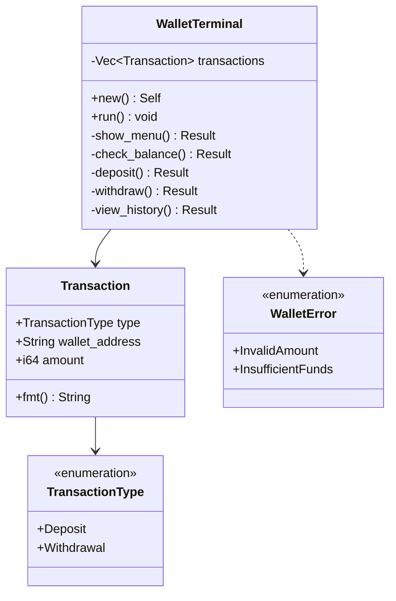

# Ryz Labs Wallet Balance Tracker

A Rust-based cryptocurrency wallet balance tracker that provides secure transaction management and real-time balance tracking with comprehensive logging.

## Architecture



## System Flow



## Core Components

### Data Structures


## Features

- Interactive terminal interface for wallet management
- Secure transaction processing with validation
- Real-time balance tracking
- Comprehensive transaction history
- Detailed logging system with timestamps
- Error handling with detailed feedback

## Core Functions

- `WalletTerminal`: Interactive interface for wallet operations
- `calculate_wallet_balance`: Processes transactions and validates balances
- `print_transaction_history`: Displays formatted transaction history
- `init_logging`: Configures logging with timestamp and context

## Error Handling

Robust error handling for:
- Invalid transaction amounts
- Insufficient funds
- Input validation
- File system operations
- Logging system failures

## Testing

Comprehensive test suite covering:
```bash
cargo test -- --test-threads=1
```

Test coverage includes:
- Terminal interface operations
- Transaction processing
- Balance calculations
- Error conditions
- Multi-wallet scenarios
- Transaction history
- Display formatting

### Log Files
- Terminal logs: `/logs/src/terminal_*.log`
- Test logs: `/logs/tests/*_log_output.log`

## Usage Example

```rust
// Initialize terminal
let mut terminal = WalletTerminal::new();
terminal.run();

// Available operations:
// 1. Check Balance
// 2. Deposit
// 3. Withdraw
// 4. View Transaction History
// 5. Exit
```

## Security Features
- Input validation
- Balance verification before withdrawals
- Transaction logging with timestamps
- Error tracking and reporting
- Secure state management

## Directory Structure
```
ryz-labs/
├── src/
│   ├── lib.rs
│   ├── main.rs
│   └── terminal/
│       └── mod.rs
├── tests/
│   └── transaction_tests.rs
└── logs/
    ├── src/
    │   └── terminal_*.log
    └── tests/
        └── *_log_output.log
```

## Installation & Setup

```bash
# Create required directories
mkdir -p logs/src logs/tests

# Build the project
cargo build

# Run tests
cargo test -- --test-threads=1

# Run the application
cargo run
```

## Logging System

The application maintains two types of logs:
1. **Terminal Logs** (`logs/src/`):
   - Format: `terminal_YYYYMMDD_HHMMSS.log`
   - Contains: User interactions, transactions, balance checks

2. **Test Logs** (`logs/tests/`):
   - Format: `test_name_log_output.log`
   - Contains: Test execution details, assertions, validations
